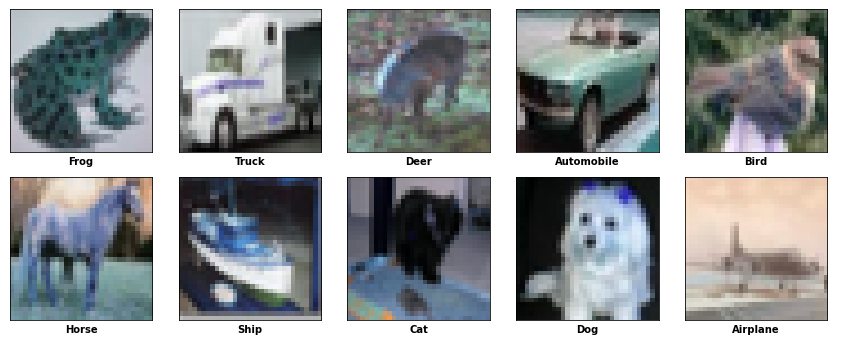

# Multi-Class Classification with CIFAR Dataset
This repository contains a Python notebook that demonstrates multi-class classifcation using transfer learning on the CIFAR dataset. The goal is to create a model that can accurately classify images into one of the ten classes present in the CIFAR dataset.

## Dataset
The CIFAR dataset is a popular benchmark dataset for image classification tasks. It consists of 50,000 training images and 10,000 testing images, each of size 32x32 pixels. The dataset is divided into ten classes, including airplanes, cars, birds, cats, deer, dogs, frogs, horses, ships, and trucks. The notebook uses the CIFAR-10 variant, which focuses on these ten classes.

## Dependencies
To run the notebook, you need the following dependencies:
* TensorFlow
* Numpy
* Pandas
* Matplotlib
* Seaborn
* sklearn
* mlxtend
* cv2
* glob
* os

## File structure
* cifar_multi_class.ipynb:  The main Jupyter Notebook containing the code and instructions for multi-class classification on the CIFAR dataset.

* model deployment.ipynb: The Jupyter Notebook containing the code for testing and deploying the model.

* train/: Directory containing training data.
* test/: Directory containing test data.

## Preprocessing
Before running this notebook, you must install it locally and install the dataset split into two folders: train and test data with two csv files naming train_labels.csv and predictions.csv for test data labels.

To install the notebook locally, run the following command in a terminal:

`git clone https://github.com/Ali-Hossam/CIFAR-transfer-learning.git`

To install the dataset, download it from the following link: [Link to dataset](https://www.cs.toronto.edu/~kriz/cifar.html)

Once you have downloaded the dataset, unzip it and extract the two folders: train and test, move the train and test folders to the same directory as this notebook.

Finally, open the notebook in a Jupyter Notebook.
